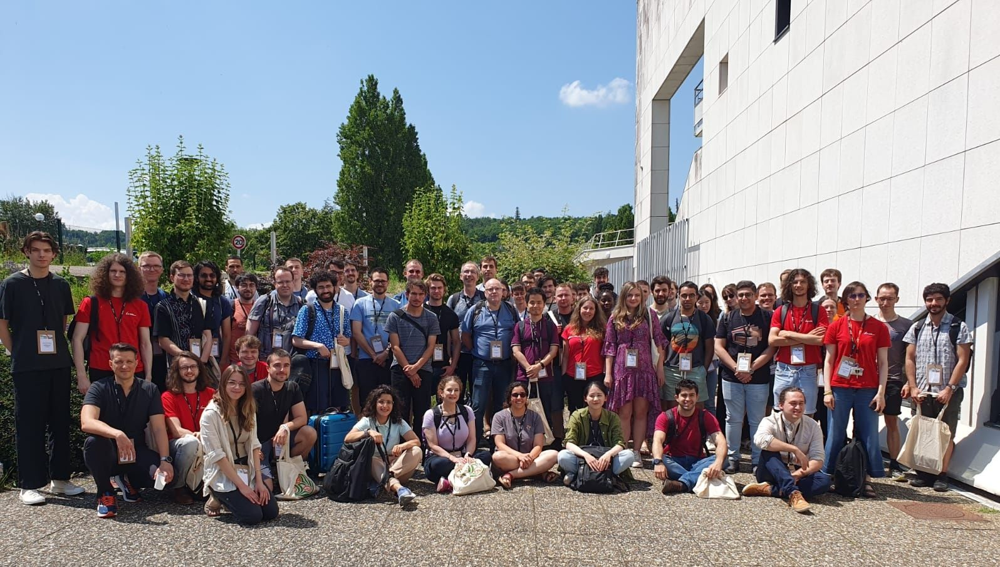

This summer I attended the  [SAT/SMT/AR summer school](https://sat-smt-ar-school.gitlab.io/www/2024/index.html) in Nancy, France. It was a very intense experience, I had the opportunity to learn about some of the ongoing research and the latest challenges in the field.

Although all the lectures were very interesting, I have to admit that the ones given by [Haniel Barbosa](https://hanielbarbosa.com/) and [Chantal Keller](https://www.lri.fr/~keller/index-en.html) were the ones I enjoyed the most, since those were the ones that were more related to my bachelor thesis. Besides, I had the opportunity to meet a lot of colleagues who were doing research on the topics of the school, which was a very enriching experience from a professional and personal way.

Here is a photo of us, after a nice lunch:

I also enjoyed the oportunity of visiting Nancy as a city(wow! what a square they have).

Finally, I would like to thank the organization committee for accepting me as a participant and for making the effort of hosting 2024 edition of the school.
